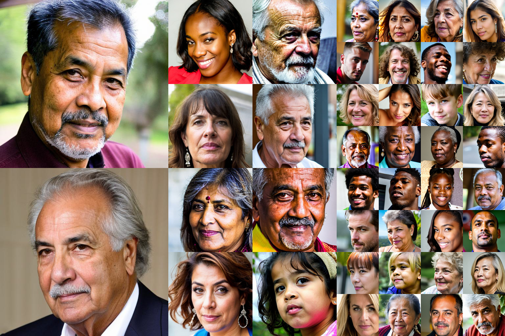

# USING SYNTHETIC DATA FOR FACE ATTRIBUTES RECOGNITION




> **USING SYNTHETIC DATA FOR FACE ATTRIBUTES RECOGNITION**<br>
> Raman Charapennikau  
> Belarussian State University  
> **Abstract:**  The paper explores the usage of diffusion models to create synthetic datasets for facial attribute recognition, focusing on age, gender and ethnicity prediction. We compare models trained on real-world data, synthetic data, and a combination of both. We demonstrate that pretraining on synthetic data followed by fine-tuning on real samples outperforms models trained solely on real-world data. Our results highlight the potential of synthetic data to enhance neural network performance in regression and classification tasks.

## Dataset Creation

First, Download Humans model from [CivitAI](https://civitai.com/models/542430/humans-reloaded) and put it to `pretrained_models` folder.


Then run following command:
```bash
python create_dataset.py --dest-folder <DATASET_SAVE_FOLDER> --total-images <NUMBER_OF_IMAGES_TO_GENERATE> --num_images_per_folder <NUMBER_OF_IMAGES_TO_GENERATE> 
```

## Model Training

### UTK/Ours
For example to train on synthetic data only:
```bash
python train.py -c ./configs/synth-only.yaml
```

### FairFace
For example to train on FairFace data only:
```bash
python ff_train.py -c ./configs/ff-only.yaml
```


## Model Evaluation
Run following command
```bash
python eval.py --checkpoint <PATH_TO_CHECKPOINT>
```